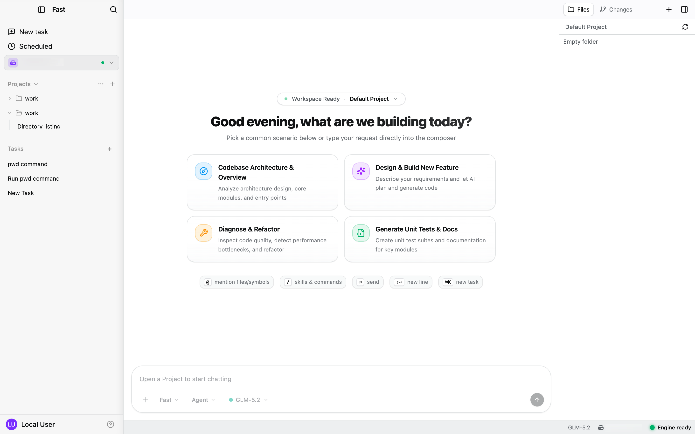
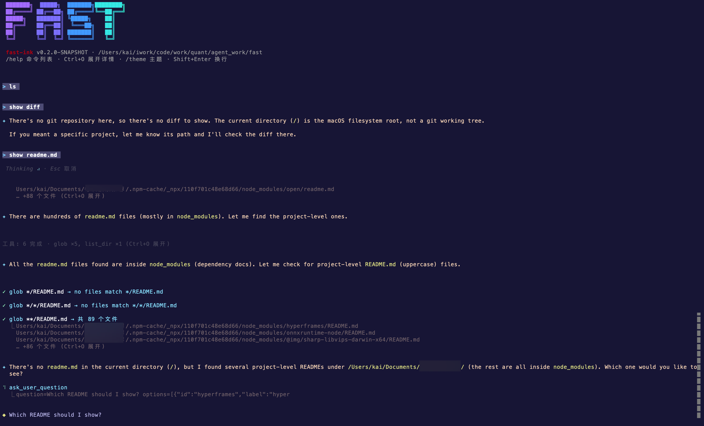
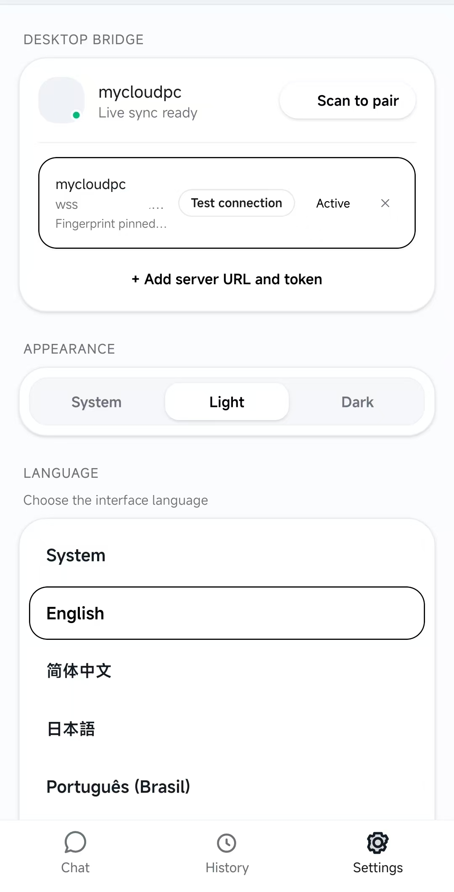
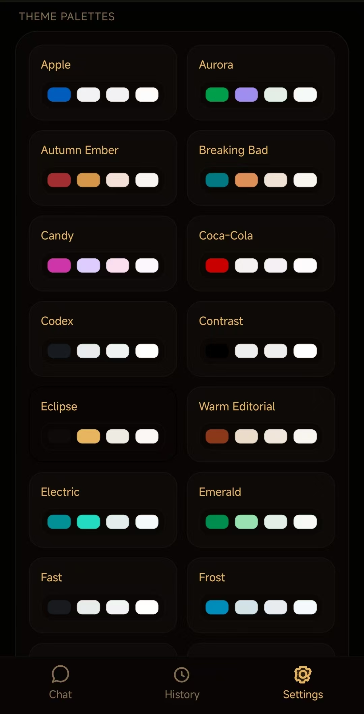

<div align="center">
  
</div>

<p align="center">
  <strong>企业级自学习 AI Agent，coding 是一等公民。</strong>
</p>

<p align="center">
  <a href="#1-下载与安装"></a>
</p>

<p align="center">
  
  <a href="LICENSE"></a>
  
  
  <a href="https://discord.gg/HXeK9QV57"></a>
</p>

<p align="center"><a href="README.md">English</a> | <a href="README.zh-CN.md">中文</a></p>

<p align="center">
  <a href="#1-下载与安装">1. 下载</a> ·
  <a href="#11-直接下载">1.1 安装包</a> ·
  <a href="#12-怎么使用移动客户端实验性高频开发中">1.2 移动客户端</a> ·
  <a href="#13-通过源码安装">1.3 源码</a> ·
  <a href="#2-开发">2. 开发</a> ·
  <a href="#21-快速开始">2.1 快速开始</a> ·
  <a href="#3-截图">3. 截图</a> ·
  <a href="#4-社区">4. 社区</a> ·
  <a href="CONTRIBUTING.md">Contributing</a> ·
  <a href="SECURITY.md">Security</a> ·
  <a href="#5-许可证">5. 许可证</a>
</p>

Fast Agent 的目标是成为企业级、自学习的 AI Agent，并把 coding 作为一等公民。

- **企业级** – 提供可审查、可管理、可观测的能力，覆盖代码审查、回滚与追踪。
- **自学习** – 持续从项目经验中学习，下一任务优于上一任务。
- **Coding 优先** – 直接改代码、跑代码、落地代码，而不只是谈论代码。
- **集群与远程** – 支持多智能体协作与远程任务编排，分布式执行。
- **Agent 原生** – 所有组件都是 Agent，自主协作、高度可组合。

> [!IMPORTANT]
> Fast Agent **仍在开发中**（v0.0.1）。本机引擎可以改你的工作区并执行 shell。请审阅每一条审批，预期会有破坏性变更，不要把未签名安装包当作生产发行。软件按 [Apache 2.0](LICENSE) 按现状提供。

## 1. 下载与安装

v0.0.1 预发布。**macOS** 是主路径。**Windows** 原生开发中。安装包未签名。

### 1.1 直接下载

| 类型 | 平台 | 下载 | 安装方式 | 测试状态 | 构建命令 |
| --- | --- | --- | --- | --- | --- |
| 桌面 | macOS（Apple Silicon） | [下载 `Fast-*-mac-arm64.dmg`](https://github.com/kai2002/fast/releases/latest) | 打开 DMG，运行 `Install Fast.pkg` → `/Applications` + `/usr/local/bin` shim | 较好 | `pnpm pack:desktop -- --clean --os darwin-arm64` |
| 桌面 | macOS（Intel） | [下载 `Fast-*-mac-x64.dmg`](https://github.com/kai2002/fast/releases/latest) | 与 Apple Silicon 相同。独立包，不是 universal | 未测试 | `pnpm pack:desktop -- --clean --os darwin-x64` |
| 桌面 | Linux（glibc x64） | N/A（未验证） | 解压 `linux-unpacked`。不支持 Alpine / musl | 未测试 | `pnpm pack:desktop -- --clean --os linux-x64` |
| 桌面 | Linux（glibc arm64） | N/A（未验证） | 解压 `linux-arm64-unpacked`。独立包，不是 universal | 未测试 | `pnpm pack:desktop -- --clean --os linux-arm64` |
| 桌面 | Windows（x64） | N/A（未验证） | 解压 `win-unpacked`（`Fast.exe`）。没有安装包。开发中；日常请用 WSL2 | 未测试 | `pnpm pack:desktop -- --clean --os win32-x64` |
| 移动端 | Android | N/A（未验证） | `adb install` 配套 APK，再与桌面配对 | 较好 | `pnpm pack:mobile` |
| 移动端 | iOS | N/A（未验证） | 配套客户端，走 Expo / 源码（Xcode，macOS）。与桌面配对。没有 IPA | 未测试 | `pnpm --dir apps/mobile ios` |
| CLI | macOS（Apple Silicon） | N/A（未验证） | 解压 `fast-ink` + `fast-cli`（别名 `fast`） | 部分 | `pnpm pack:cli -- --clean --os darwin-arm64` |
| CLI | macOS（Intel） | N/A（未验证） | 与 Apple Silicon 相同。独立包 | 未测试 | `pnpm pack:cli -- --clean --os darwin-x64` |
| CLI | Linux（glibc x64） | N/A（未验证） | 解压 `fast-ink` + `fast-cli`（别名 `fast`）。不支持 Alpine / musl | 未测试 | `pnpm pack:cli -- --clean --os linux-x64` |
| CLI | Linux（glibc arm64） | N/A（未验证） | 与 Linux x64 相同。独立包 | 未测试 | `pnpm pack:cli -- --clean --os linux-arm64` |
| CLI | Windows（x64） | N/A（未验证） | 解压 `cli-win32-x64`（`fast-cli.bat`，别名 `fast.bat`）。开发中 | 未测试 | `pnpm pack:cli -- --clean --os win32-x64` |

打包方式见 [1.3 通过源码安装](#13-通过源码安装)。

你可以通过微信群或 Discord 获得帮助。

<div align="center">

| 微信群 | Discord |
| :---: | :---: |
|  | [加入 Fast Agent](https://discord.gg/HXeK9QV57) |

</div>

### 1.2 怎么使用移动客户端（实验性，高频开发中）

手机是遥控器。不在手机上起引擎，不改文件。先装 App（Android：`adb install` 同一发行里的 APK；iOS：走 Expo / 源码，未测试），再选一种连法。

#### 1.2.1 局域网（桌面）

手机连本机已经在跑的桌面 Fast，同一局域网。

1. **先装桌面**（[1.1 直接下载](#11-直接下载)）。macOS 是主路径。
2. **打开局域网桥接**，再启动桌面。必须带 token。默认端口 `8787`：

```bash
FAST_MOBILE_BRIDGE_TOKEN='your-secret' /Applications/Fast.app/Contents/MacOS/Fast
```

源码开发时把同一变量加在 `pnpm dev:desktop` 前面。可选 `FAST_MOBILE_BRIDGE_PORT`。

3. **配对。** 桌面 → 设置 → 服务器 → 手机配对。手机：设置 → 扫码配对。也可手填地址和 token。

访客 Wi-Fi / 客户端隔离，或防火墙挡住 `8787`，都会连不上。桌面必须一直开着。

#### 1.2.2 公网（远程 CLI）

手机直连远程 Linux / macOS 上的 `fast-cli`，不经过本机桌面。

1. **先跑 fetch**，写出 `modules/engine/current/`。目录必须和服务器的 OS / 架构一致 — 不要随后把 Darwin 的 `current/` 拷到 Linux。`--clean` **会覆盖**本机 `current/`。

```bash
pnpm fetch-engine                          # 当前主机 OS
pnpm fetch-engine -- --clean linux-x64     # 打 Linux x64 包（或 linux-arm64）
```

2. **上传** `modules/engine/current/` 到服务器。服务器需要 **JDK 17+**。
3. **启动 CLI**，让它听公网口。非 loopback 走 `wss`（TLS；不写 `--wss-cert` / `--wss-key` 会自动签发）：

```bash
./bin/fast-cli engine --mode bridge --transport unix --wss 0.0.0.0:1979
```

4. **在服务器上取 token。** Token 进 `Hello.authToken`，不进 URL：

```bash
cat ~/.fast/run/bridge.token
```

5. **手机连接。** 设置 → 手填服务器地址和 token。地址是 `wss://<host>:1979/bridge`。指纹由客户端自动确认。

在主机防火墙 / 安全组放行 `1979`（或你改的端口）。自备证书用 `--wss-cert` / `--wss-key`。

#### 1.2.3 连上之后

对话 Tab 是最近会话；历史列出会话；会话里可发消息、审批、打断。主题和语言只存在手机上。

配对 token 等于全部权限，不要截图或外传。手机丢了就当 token 泄露 — 换 token 再配对。详见 [SECURITY.md](SECURITY.md)。

### 1.3 通过源码安装

| 需要    | 版本                                     |
| ------- | ---------------------------------------- |
| Node.js | 20.19+ 或 22                             |
| pnpm    | 9（`package.json` 里的 `packageManager`） |
| JDK     | 17+（仅桌面 / TUI 引擎）                 |
| Maven   | 3.x（仅桌面 / TUI 引擎）                 |

Linux 还需要编译 `node-pty` 的工具链（`build-essential`）、Electron 用的 GTK/NSS，以及 `lsof` / `procps`。手机额外依赖（Android SDK、Xcode）只在跑 App 时需要。

```bash
git clone https://github.com/kai2002/fast.git
cd fast
pnpm install
pnpm fetch-engine          # Maven Central → modules/engine/current/
pnpm pack                  # 桌面 + CLI + 手机，JS/引擎只 stage 一次
```

这是主路径。默认为增量：`.fast-os` 一致才复用 `current/`，不一致则失败 — 用 `--clean`。不要在机器之间拷贝 `current/`。引擎 native 与 Electron 二进制共用 `--os`。不是 universal。

`pnpm pack` 的产物：

- **macOS Apple Silicon** — 未签名 `Fast-*-mac-arm64.dmg`（`Install Fast.pkg` → `/Applications` + `/usr/local/bin` shim）
- **macOS Intel** — 未签名 `Fast-*-mac-x64.dmg`（安装方式相同）。独立包
- **Linux glibc x64** — `linux-unpacked`（`--os linux-x64`）。不支持 Alpine / musl
- **Linux glibc arm64** — `linux-arm64-unpacked`（`--os linux-arm64`）。独立包
- **Windows x64** — `win-unpacked`（`--os win32-x64`）。没有安装包。可在 macOS 上打，不要在那里跑 `Fast.exe`。开发中；日常请用 WSL2
- **CLI** — `release/cli-darwin-arm64` / `cli-darwin-x64` / `cli-linux-x64` / `cli-linux-arm64` / `cli-win32-x64`（`fast-ink` + `fast-cli`，别名 `fast`）；`release/cli` → 最近一次产物
- **Android** — `release/fast-mobile-*.apk`（`adb install`）。没有 SDK：跳过，exit 0
- **iOS** — 没有 IPA。`pnpm --dir apps/mobile ios`（`expo run:ios`；Xcode，macOS）。日常：`./dev/mobile.sh --ios`

只打一个产品，或干净重打：

```bash
pnpm pack:desktop                              # 只打本机安装包
pnpm pack:desktop -- --clean --os darwin-arm64 # Apple Silicon
pnpm pack:desktop -- --clean --os darwin-x64   # Intel
pnpm pack:desktop -- --os darwin-both          # 两个 mac 包（每轮 --clean）
pnpm pack:desktop -- --clean --os linux-x64    # Linux glibc x64（dir）
pnpm pack:desktop -- --clean --os linux-arm64  # Linux glibc arm64（dir）
pnpm pack:desktop -- --clean --os win32-x64    # Windows x64（dir）
pnpm pack:cli -- --os darwin-arm64             # release/cli-darwin-arm64
pnpm pack:cli -- --os darwin-x64               # release/cli-darwin-x64
pnpm pack:cli -- --os linux-x64                # release/cli-linux-x64
pnpm pack:cli -- --os linux-arm64              # release/cli-linux-arm64
pnpm pack:cli -- --os win32-x64                # release/cli-win32-x64
pnpm pack:mobile                               # 只打 APK
pnpm --dir apps/mobile ios                     # iOS（Xcode；没有 IPA）
pnpm pack -- --clean                           # 重新拉引擎并 restage
```

`./build/all.sh` 与 `pnpm pack` 等价（同样支持 `--os`）。每个 `build/*.sh` 都有 `--help`。跨架构打包的 smoke 只检查 `file` 和 `.fast-os`，不要启动另一架构的 `.app`、Linux dir 或 `Fast.exe`。日常 `dev/` 命令见 [2. 开发](#2-开发)。

## 2. 开发

`pnpm` 脚本调用 `dev/` 和 `build/` 下的文件，两种写法等价。每个脚本都有 `--help`。

### 2.1 快速开始

`pnpm dev:*` 和 `./dev/*.sh` 是一回事。第 1 步做完后，只跑你正在改的那一层。

1. **准备环境** — 克隆仓库、安装 JS 依赖，并把本机引擎下载到 `modules/engine/current/`。这份只能在当前系统用，不要从另一台机器拷过来。只改手机可以不做 `fetch-engine`。

```bash
git clone https://github.com/kai2002/fast.git
cd fast
pnpm install
pnpm fetch-engine
```

2. **开发桌面** — 对 `current/` 启动 Electron。`--mock` 只起界面、不连引擎。缺 `current/` 时加 `--engine` 会先下载再启动。

```bash
pnpm dev:desktop
pnpm dev:desktop:mock
./dev/desktop.sh --engine
```

3. **开发 TUI** — 对同一份 `current/` 启动 `fast-ink`。

```bash
pnpm dev:tui
./dev/tui.sh --engine
```

4. **开发手机** — 启动 Expo / Metro。加 `--android` 或 `--ios` 打开设备。

```bash
pnpm dev:mobile
./dev/mobile.sh --android
./dev/mobile.sh --ios
```

5. **刷新引擎** — 只在换了系统，或 `current/` 架构不对时做。

```bash
pnpm fetch-engine -- --clean
```

### 2.2 命令

完整列表。打安装包走 [1.3 通过源码安装](#13-通过源码安装)；这里日常是 `dev:*`，然后跑测试。

| 脚本                           | 作用                                                         |
| ------------------------------ | ------------------------------------------------------------ |
| `pnpm fetch-engine`            | Maven Central `ai.fastllm` 0.3.0 → `modules/engine/current/` |
| `pnpm dev:desktop`             | `./dev/desktop.sh` — Electron 对 `current/`                  |
| `pnpm dev:desktop:mock`        | `./dev/desktop.sh --mock` — 仅 UI                            |
| `pnpm dev:tui`                 | `./dev/tui.sh` — `fast-ink` 对 `current/`                    |
| `pnpm dev:mobile`              | `./dev/mobile.sh` — Expo（`--android` / `--ios`）            |
| `pnpm pack`                    | CLI + 桌面 + 手机（`build/all.sh`）。`--os` 选架构           |
| `pnpm pack:desktop`            | 本机或 `--os` 安装包。macOS：`Fast-*-mac-arm64.dmg` / `Fast-*-mac-x64.dmg`。Linux：`linux-unpacked` / `linux-arm64-unpacked`。Windows：`win-unpacked`（不是 universal） |
| `pnpm pack:cli`                | 可挪走的 `cli-darwin-arm64` / `cli-darwin-x64` / `cli-linux-x64` / `cli-linux-arm64` / `cli-win32-x64`（`release/cli` → 最近一次） |
| `pnpm pack:mobile`             | Android APK；缺 JDK/SDK 则跳过（exit 0）                     |
| `pnpm build`                   | 编译 TypeScript 包 — 不是 `build/*.sh`                       |
| `pnpm test` / `pnpm typecheck` | 工作区测试 / 类型检查                                        |

提 PR 前跑测试和类型检查。TUI unix e2e 会向上查找 `current/bin/fast-cli`。Linux 上 TUI 出现豆腐块时设 `LANG=C.UTF-8`。

```bash
pnpm test
pnpm typecheck
```

补丁与 PR：[CONTRIBUTING.md](CONTRIBUTING.md)。漏洞：[SECURITY.md](SECURITY.md)（私下 advisory，不要开公开 issue）。这两份目前是英文。

### 2.3 代码结构

```text
fast/
  apps/desktop          Electron → core + web/ui
  apps/tui              fast-ink → core（无 DOM）
  apps/mobile           Expo 配套 → core（不 import web/ui）
  apps/web              预留；与桌面 renderer 同一套
  packages/core         无 DOM — bridge、session-view、i18n
    bridge/protocol     NDJSON schema
    bridge/client       ensureDaemon / IPC
    session-view        事件 → 视图模型
    i18n                文案 + resolve
  packages/web/ui       React 设计系统（桌面 + 以后的 web）
  dev/                  desktop.sh  tui.sh  mobile.sh
  build/                desktop.sh  cli.sh  mobile.sh  all.sh
  scripts/              fetch-engine.sh  pack-common.sh  …
  modules/engine        fetch-engine → current/bin/fast-cli（gitignore；别名 fast）
  extensions/           Maven 多模块（Wave 2 引擎插件）
```

分层：

- `packages/core` — 无界面。TUI 和手机只依赖这里。
- `packages/web` — React token 与控件。不是产品入口。
- `apps/*` — 可运行产品。桌面 renderer 是网页技术，宿主仍是 Electron。
- 目录布局不是安装布局。`apps/` 下没有必须打进 engine jar 的东西。

依赖：

- `session-view` / `bridge-client` → `bridge-protocol`
- `apps/tui` → core
- `apps/desktop` → core + `web/ui`
- `apps/mobile` → core（`i18n`、`session-view`）；不 import `web/ui`

npm 名（暂不改）：`@fastllm/bridge-protocol`、`@fastllm/bridge-client`、`@fast-ide/session-view`、`@fast-ide/i18n`、`@fast-ide/ui`。

`all.sh` 只 source 一次 `pack-common`（引擎 + JS + stage），再打 CLI 和桌面。手机不读引擎树。桌面和 CLI 都 `--skip` 时不 source pack-common。

更多：[doc/structure.md](doc/structure.md)、[modules/engine/README.md](modules/engine/README.md)。

## 3. 截图



桌面 — 项目、会话、本机引擎。



TUI（`fast-ink`）— 同一引擎，走 unix Bridge。

<p align="center">
  
  
  
  
</p>

手机 — 配套客户端：会话、与桌面 Bridge 配对、主题。

## 4. 社区

选一个常用渠道讨论使用、开发和进展。

<div align="center">

| 微信群 |
| :---: |
|  |

Discord：[加入 Fast Agent](https://discord.gg/HXeK9QV57)

</div>

## 5. 许可证

[Apache License 2.0](LICENSE)
