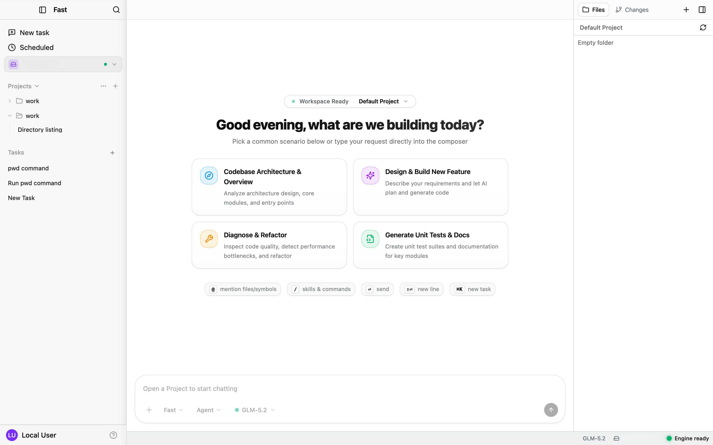
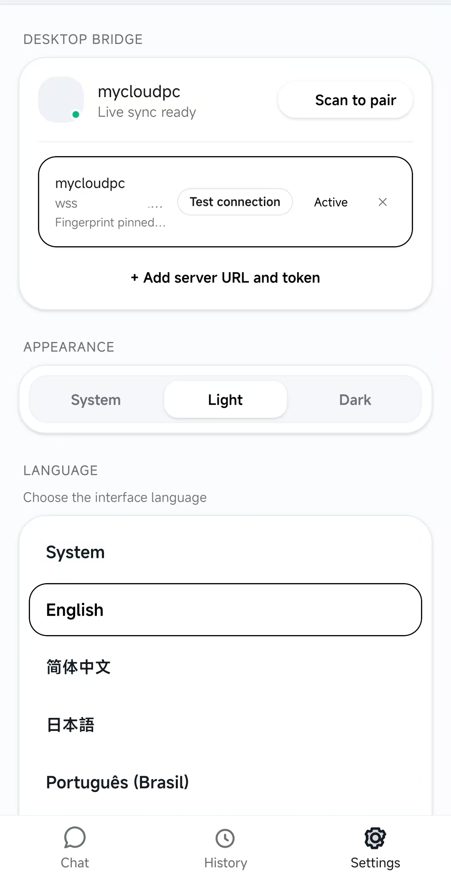
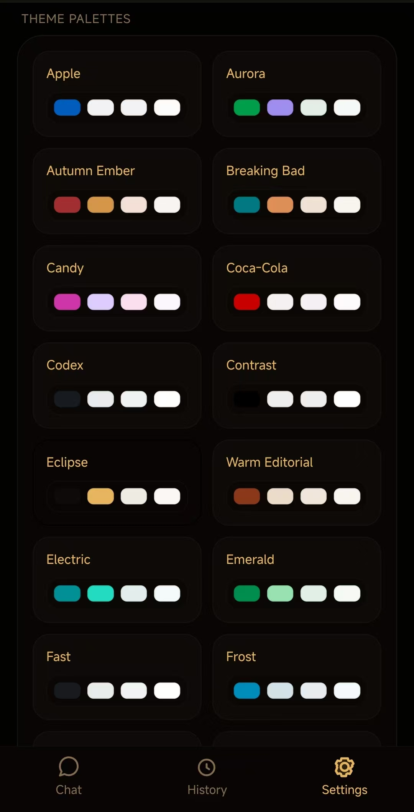
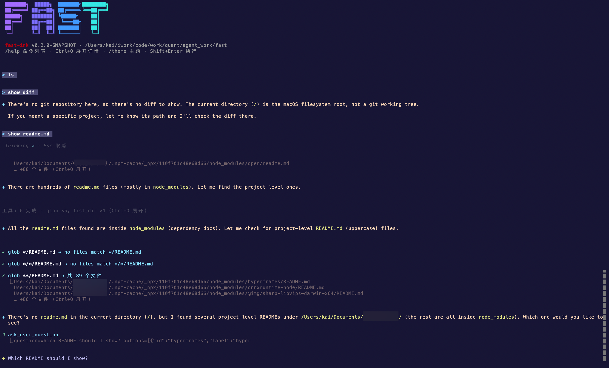

<div align="center">
  
  <h1>Fast Agent</h1>
  <p><strong>开源版 Muse / Grok 随身助理，更是你随时调遣的百人级多智能体编程与自动化工程团队。</strong></p>

  <p>
    <a href="https://github.com/kai2002/fast-agent/releases"></a>
    <a href="LICENSE"></a>
    
    <a href="https://discord.gg/HXeK9QV57"></a>
  </p>

  <p>
    <a href="README.md">English</a> | <a href="README.zh-CN.md">简体中文</a>
  </p>
</div>

---

**Fast Agent** 重新定义了个人 AI 助理与软件工程范式。它既具备 **Muse / Cue** 般无缝陪伴、跨端随行的随身助理体验，又拥有 **Grok** 般硬核、迅捷与自主的执行力；更重要的是，它原生内置了**多智能体集群调度中心**，让你无论在桌面端、终端还是手机上，都能随时指挥一支训练有素的专属 AI 软件工程军团。

> [!IMPORTANT]
> Fast Agent 目前处于**高频活跃开发期**（v0.3.1）。本机引擎支持直接修改工作区并经审批执行 shell。请注意审阅每一项授权，体验最前沿的 Agentic Coding！

---

## 🚀 核心亮点：为什么选择 Fast Agent？

### 1. 👥 指挥你的专属 AI 助理军团（集群与多 Agent 编排）
告别单一单薄的 Chatbot。Fast Agent 让你化身指挥官，一键编排专属工程团队：
- **专职角色分工**：在同一个工作区内同时唤醒架构师、核心编码员、自动化测试员与质量核查员。
- **自主协同与博弈**：Agents 之间自动拆解目标、委派子任务、交叉审阅代码，不达验收标准誓不罢休。
- **分布式集群算力**：任务既可在本机安静执行，也能一键调度编排到远程工作站与服务器集群。

### 2. 💻 Coding 是一等公民（真落地，非口嗨）
不只是在聊天框里吐出 Markdown 代码块，Fast Agent 深入开发闭环：
- **深度理解与修改**：精准索引代码库、规划变更集（Diff）、原子化修改多文件，并执行真实编译。
- **企业级可信机制**：实时可视化的代码 Diff 审查、可逐次追溯的 Checkpoint 账本，随时一键安全回滚。
- **自我进化与验证**：自动运行单元测试与构建，拦截编译器报错，持续诊断修正直至通过验收。

### 3. 📱 全场景随身（桌面端、移动端、TUI 纯命令行）
- **桌面工作台（Desktop）**：功能完备的重型武器，集成 Diff 审查、项目树、多会话标签与 Agent 拓扑追踪。
- **随身遥控器（Mobile）**：下班通勤、出差在外？掏出手机随时连上工位电脑或云端引擎。一句语音安排重构任务，实时查看终端日志流，单手滑动点击完成代码合并审批。
- **黑客级终端（TUI）**：超低延迟、极速响应的纯 Unix Bridge 命令行界面，SSH 极客的梦中情端。

### 4. 🔌 可插拔的多引擎生态
按会话自由切换底层执行大脑。Fast Agent 原生搭载高性能自研引擎，并原生兼容第三方引擎（如 **DeepSeek DSH**）与社区扩展。

---

## 📸 产品界面一览

<div align="center">
  <h3>桌面工作台 — 多 Agent 协同、任务看板与可视化 Diff 审查</h3>
  
</div>

<br/>

<div align="center">
  <h3>移动配套端 — 随身指挥、实时日志流与一键审批流</h3>
  <p align="center">
    
    
    
    
  </p>
</div>

<br/>

<div align="center">
  <h3>极速 TUI 终端 — 轻量纯粹，原生 Unix Bridge</h3>
  
</div>

---

## ⚡ 极速上手：30 秒开启体验

### 1. 下载开箱即用的安装包

直接前往 [GitHub Releases](https://github.com/kai2002/fast-agent/releases) 获取各平台构建：

| 平台 | 安装包 | 安装方式 |
| :--- | :--- | :--- |
| **macOS（Apple Silicon）** | `Fast-*-mac-arm64.dmg` | 打开 DMG，运行 `Install Fast.pkg` |
| **macOS（Intel）** | `Fast-*-mac-x64.dmg` | 打开 DMG，运行 `Install Fast.pkg` |
| **Android 手机端** | `fast-mobile-*.apk` | 手机安装 APK，一键与桌面配对 |
| **Linux（x64 / arm64）** | `Fast-*-linux-*.AppImage` | 赋予执行权限 `chmod +x` 后直接运行 |
| **Windows（x64）** | `Fast-*-win-x64.exe` | 运行 NSIS 安装包 *(高频开发中)* |

### 2. 手机随身控制（两步配对）

1. **打开桌面端**：前往 `设置` → `服务器` → 开启 **手机配对**。
2. **手机扫码**：打开 Fast 手机端，点击 **扫码配对** 扫描桌面上的二维码即可瞬间完成连接。
3. *异地或蜂窝网络？* 桌面端一键切换到 **Cloudflare 隧道** Tab，无需公网 IP 和端口映射，手机即可全球随时随地直连工位电脑！

---

## 🛠️ 开发者与贡献指南

Fast Agent 采用模块化 Monorepo 架构：包含基于 TypeScript/React 的跨端交互层，以及高并发的多 Agent 调度引擎。

### 仓库代码分层

```text
fast/
  apps/desktop          Electron 桌面应用（Renderer + Bridge IPC 桥）
  apps/tui              fast-cli 纯交互式终端应用
  apps/mobile           Expo React Native 移动端（Android / iOS）
  packages/core         核心协议库：Bridge 协议、Session 状态流与国际化
  packages/web/ui       React 跨端设计系统与原子组件库
  modules/engine        高性能 Agent 运行时核心（内置开箱即用 JRE）
  extensions/           可扩展插件模块（如 DeepSeek DSH 引擎适配器）
```

### 环境要求

| 依赖 | 推荐版本 | 说明 |
| :--- | :--- | :--- |
| **Node.js** | 20.19+ 或 22 | 运行应用与前端构建 |
| **pnpm** | 9 | 单仓包管理 |
| **JDK** | 17+ | 仅本地组装引擎依赖时需要（`fetch-engine`） |
| **Maven** | 3.x | 仅当需要编译引擎扩展插件时需要 |

### 本地开发命令

```bash
# 1. 克隆代码并安装依赖
git clone https://github.com/kai2002/fast-agent.git
cd fast-agent
pnpm install

# 2. 拉取预编译好的引擎二进制文件
pnpm fetch-engine

# 3. 启动你想调试的客户端
pnpm dev:desktop       # 启动桌面 Electron 应用
pnpm dev:tui           # 启动 TUI 终端客户端
pnpm dev:mobile        # 启动移动端（Expo / Metro）
```

### 测试与类型检查

```bash
pnpm test              # 执行单元测试与 E2E 测试套件
pnpm typecheck         # 跨包执行 TypeScript 类型校验
```

<details>
<summary><b>📦 生产打包构建命令（点击展开）</b></summary>

```bash
# 一键打包全平台产物
pnpm pack

# 分平台单独打包
pnpm pack:desktop                              # 本机操作系统安装包
pnpm pack:desktop -- --clean --os darwin-arm64 # Apple Silicon macOS
pnpm pack:desktop -- --clean --os darwin-x64   # Intel macOS
pnpm pack:desktop -- --clean --os linux-x64    # Linux AppImage
pnpm pack:desktop -- --clean --os win32-x64    # Windows NSIS
pnpm pack:cli                                  # 独立 fast-cli 压缩包
pnpm pack:mobile                               # Android APK
```
</details>

---

## 💬 社区与交流

欢迎加入我们的开源交流群，分享你的 Agent 工作流，或向维护团队直接反馈建议：

<div align="center">
  <table>
    <tr>
      <td align="center">
        <b>官方微信交流群</b><br/><br/>
        
      </td>
      <td align="center" width="260">
        <b>Discord 国际社区</b><br/><br/>
        <a href="https://discord.gg/HXeK9QV57">
          
        </a>
      </td>
    </tr>
  </table>
</div>

---

## 📄 许可证与安全

- **软件协议**：基于 [Apache License 2.0](LICENSE) 开源。
- **参与贡献**：请参阅 [CONTRIBUTING.md](CONTRIBUTING.md)。
- **安全报告**：如发现安全漏洞，请通过 [SECURITY.md](SECURITY.md) 约定渠道进行私下披露。
